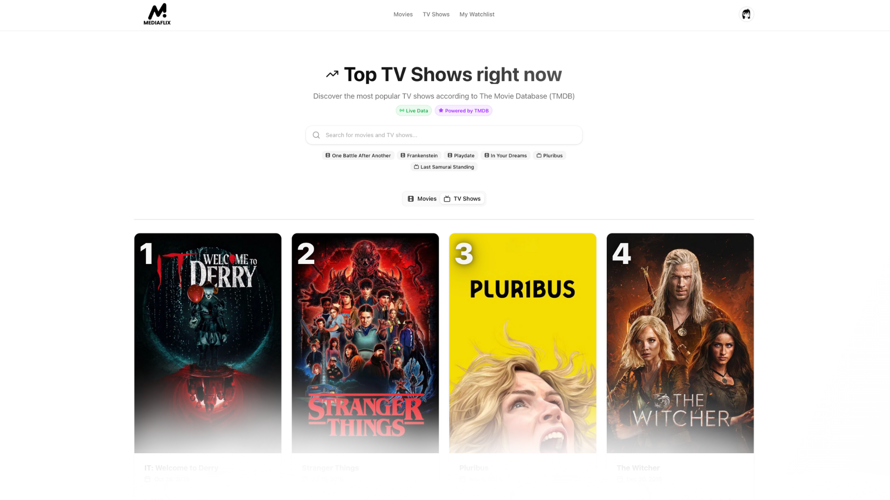

<p align="center">
  
</p>


# MediaFlix

**MediaFlix** is a clean, fast movie/TV discovery app built with **Next.js**, **Convex**, and **Clerk**, using live data from **The Movie Database (TMDB)**.

👉 **Live demo:** https://mediaflix.digital  
_(This project is open-source and still evolving — contributions are welcome!)_

---

## 🎬 Why I Built This

Choosing what to watch takes longer than it should.  
MediaFlix is designed to be **minimal, distraction-free**, and fast — a simple way to discover movies and TV shows without the clutter of traditional databases.

---

## ✨ Features

- 🔥 Popular & trending movies/TV (TMDB)
- 🎭 Detailed media pages (cast, trailers, ratings, recommendations)
- 📺 Country-specific **watch providers**
- ⭐ Personal watchlist (Convex)
- 🔐 Authentication powered by Clerk
- 💅 Beautiful responsive UI (Tailwind CSS)
- ⚡ Fast client data management via TanStack Query

---

## 🧱 Tech Stack

- **Frontend:** Next.js 15, React 19, TypeScript 5
- **State/Data:** TanStack Query v5
- **Backend/DB:** Convex v1.29
- **Auth:** Clerk v6
- **Styling:** Tailwind CSS v4
- **Data Source:** TMDB API

---

## 🚀 Getting Started (Local Development)

### Prerequisites

- Node.js 18+
- pnpm or npm
- TMDB, Clerk, and Convex credentials
- TMDB Read Access Token (public)

---

### 1. Clone the repository

```bash
git clone https://github.com/lukef7fywmrp/mediaflix
cd mediaflix
```

### 2. Install dependencies

```bash
pnpm install
# or
npm install
```

### 3. Create your environment variables

Create a .env.local file in the project root:

```env
# Convex
# Deployment used by `npx convex dev`
CONVEX_DEPLOYMENT=
NEXT_PUBLIC_CONVEX_URL=

# Clerk
NEXT_PUBLIC_CLERK_PUBLISHABLE_KEY=
CLERK_SECRET_KEY=
# Optional: customize Clerk routes/redirects
NEXT_PUBLIC_CLERK_SIGN_IN_URL=/sign-in
NEXT_PUBLIC_CLERK_SIGN_IN_FALLBACK_REDIRECT_URL=/
NEXT_PUBLIC_CLERK_SIGN_UP_FALLBACK_REDIRECT_URL=/

# TMDB
TMDB_API_KEY=
NEXT_PUBLIC_TMDB_API_READ_ACCESS_TOKEN=
```

⚠️ Never commit real API keys. Use .env.local locally and environment variables in production.

### 4. Start development server

```bash
pnpm dev
# or
npm run dev
```

Then open:

http://localhost:3000

### 📂 Project Structure

```text
.
├─ actions/                 # Server actions
├─ app/                     # Next.js App Router pages & API
│  ├─ (auth)/               # Auth layouts/routes (Clerk)
│  ├─ (site)/               # Site routes (home, movie, tv, watchlist, etc.)
│  ├─ api/geo/              # Edge route for geo lookup
│  ├─ globals.css
│  ├─ layout.tsx
│  ├─ manifest.json
│  ├─ robots.ts
│  └─ sitemap.ts
├─ components/              # UI and feature components (shadcn/ui under ui/)
│  └─ ui/                   # shadcn/ui primitives
├─ convex/                  # Convex backend (schema, functions, generated)
│  ├─ _generated/
│  ├─ auth.config.ts
│  ├─ schema.ts
│  ├─ userProfiles.ts
│  └─ watchlist.ts
├─ hooks/                   # React hooks (queries, utils)
├─ images/                  # Static images (non-public)
├─ lib/                     # Client/utility libs (tmdb client, utils, validation)
├─ public/                  # Public assets (favicons, icons)
├─ middleware.ts            # Next.js middleware
├─ next.config.ts
├─ package.json
├─ pnpm-lock.yaml
├─ postcss.config.mjs
├─ tailwind config (via deps)
├─ tsconfig.json
└─ README.md
```

### 🛠 Useful Scripts

```bash
pnpm dev       # Run Next.js + Convex in dev mode
pnpm build     # Build for production
pnpm start     # Run production build
pnpm lint      # Lint using ESLint
```

### 🤝 Contributing

Contributions are welcome — from small fixes to major features.

- Fork the repo
- Create a new branch
- Make your changes with clear commits
- Ensure the app builds & lints
- Open a PR with a clear description

For larger features, please open an issue first to discuss the direction.

### 🔒 Security

If you discover a security vulnerability, do not open a public issue.

Please email the maintainer so it can be handled responsibly.

### 📜 License

This project is licensed under the MIT License.

See the LICENSE file for details.

### 🙏 Acknowledgements

This product uses the TMDB API, but is not endorsed or certified by TMDB.

TMDB’s branding and attribution rules apply:

https://www.themoviedb.org/documentation/api/terms-of-use

Watch provider data is powered by JustWatch:

https://www.justwatch.com

### 📚 Learn More

Next.js → https://nextjs.org/docs

Convex → https://docs.convex.dev

Clerk → https://clerk.com/docs

TMDB → https://developers.themoviedb.org
